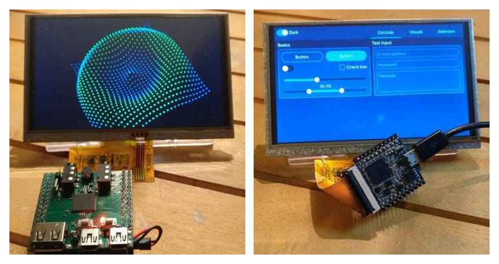

# Bare metal code examples for Allwinner's F1C100S (F1C200S) SOC

These examples work without any operating system environment. It's like programming simple microcontrollers or "old school" programming techniques. Examples can be used for educational purposes to teach low-level programming. All programs can be run on [f1c_dbc](https://github.com/minilogic/f1c_dbc) computer or [Lichee Nano](https://linux-sunxi.org/LicheePi_Nano) demoboard.
Low-level framework is simple, but provides the following features:
- work with graphic display modules: TV, TFT, HDMI (work in progress);
- examples of working with communication interfaces: UART, SPI, I2C;
- playback and recording with built-in hardware audio codec;
- USB Device/Host driver implementation;
- µSD memory card support;
- bootloader implementation from SPI-flash memory;
- examples of integrating third-party libraries: FatFs, LVGL, LWIP, TinyGL, MP3 Decoder/Encoder...

**Project directories:**

| Name                         | Description                                |
|------------------------------|--------------------------------------------|
| [doc](./doc)                 | Documentation                              |
| [drv](./drv)                 | Low-level drivers                          |
| [lib](./lib)                 | Third-party libraries                      |
| [src/demo](./src/demo)       | Classical demo effects                     |
| [src/lvgl](./src/lvgl)       | LVGL GUI-demo                              |
| [src/tinygl](./src/tinygl)   | TinyGl 3D-demo examples                    |
| [tools/sunxi](./tools/sunxi) | Tools for loading and flashing the SOC     |
| [tools/zadig](./tools/zadig) | Windows tool for installing SOC-driver     |

**Useful links:**
1. [XBOOT](https://github.com/xboot/xboot)
2. [RT-Thread](https://github.com/RT-Thread/rt-thread)
3. [F1C100S Projects](https://github.com/nminaylov/F1C100s_projects)
4. [WhyCan Forum](https://whycan.com/f_17.html)

**Disclaimer:**
The Software is furnished "AS IS", without warranty as to performance or results, and the entire risk as to performance or results is assumed by YOU. I disclaims all warranties, express, implied or otherwise, with regard to the Software, its use, or operation, including without limitation any and all warranties of merchantability, fitness for a particular purpose, and non-infringement of intellectual property rights.

